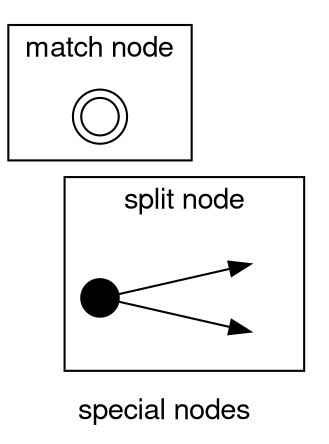
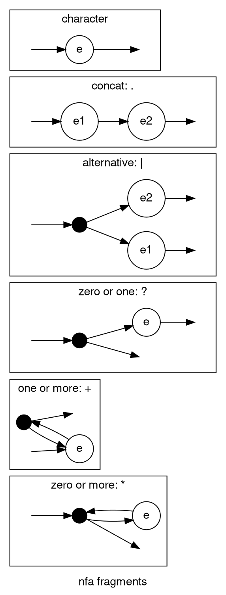

유한상태기계에 대한 자료를 조사하다 [좋은 자료](https://swtch.com/~rsc/regexp/regexp1.html)를 알게 되어 해당 내용을 구현해보기로 했다. 구체적인 구현은 다음 C언어 구현 예를 참고했다. [NFA Thompson Construction by Russ Cox · GitHub](https://gist.github.com/luchy0120/badcc9ce807e359067b0e0b17271963b). 이 알고리즘은 톰슨의 구성을 이용하여 정규표현식을 구현하는데, 구체적인 구현의 구성은 다음과 같다.

1. 정규표현식(regular expression)으로부터 후위표현식(postfix)을 만든다.
2. 후위표현식을 하나씩 읽으며 character와 특별 연산(`*`, `+`, `?`, `|`, `.`(여기서는 any character가 아니라 concat))로 state diagram을 만든다
3. 만든 state diagram에 search text를 한 글자씩 feeding해가며 처음으로 MATCH에 도달하면 True를 리턴하고 모든 search text가 소진되면 False를 리턴한다.

구현하면서 지난 번에 구현한 [Aho-corasick](https://en.wikipedia.org/wiki/Aho%E2%80%93Corasick_algorithm) 기반의 구현과 비슷한 느낌을 받았다. 사실 근본적인 생각은 같다. 원하는 pattern을 catch 할 수 있는 자료구조를 construct하고 대상 text를 한 글자씩 feeding해가며 hits를 그러모은다는 핵심은 동일하게 나타난다.

한편, Aho-corasick과는 달랐던 것은 pattern을 검증하는 자료구조가 tri(엄밀히 말하자면 fail function을 이용한 failure path가 추가된 형태의)에서 보다 일반적인 state diagram(엄밀히 말하면 SPLIT이라는 special node 여러개를 이용하여 successive multiple nodes를 표현한다는 점에서 완전히 일반적이지는 않지만)을 사용한다는 점이다. tree 기반 자료인 tri에서 보다 일반적인 directed graph인 state diagram에 더 가까워 졌다는 점에서 의미를 찾을 수 있을 것 같다.

가장 먼저 구현한 부분은 post2nfa이다. 코드는 참고한 C언어 코드를 최대한 참고했는데, 알고리즘을 이해하기 위해 postfix에 등장하는 문자를 그림으로 치환하는 점이 선행되어야 했다. 먼저 special node는 split과 match가 있으며, match에 도달했을 때 정규표현식에 해당하는 표현을 찾은 것이고 split은 2개의 선택지로 분기하는 노드의 모양이다.




그리고 정규표현식의 각 operator에 대응하는 Fragment는 다음과 같다.





위의 postfix에 해당하는 nfa fragments는 다음 코드에 각각 대응된다.
기본 객체 정의는 다음과 같으며 특기할 점은 State에 다음 노드에 연결할 `hole`이 있는 경우 후처리 함수 patch를 통해서 처리하는데, 가능한 `hole`을 out에 연결할지, out1에 연결할지 동적으로 판단하기 위하여 to_tuple에서 해당 속성명을 같이 넘긴다는 점이다.
```py
class Special(Enum):
    SPLIT = auto()
    MATCH = auto()


@dataclass
class State:
    c: str | Special
    out: Optional["State"] | None = None
    out1: Optional["State"] | None = None

    def to_tuple(self, attrname) -> Sequence[Tuple["State", str]]:
        return [(self, attrname)]

@dataclass
class Frag:
    start: State
    outs: Sequence[Tuple[State, str]]
```

위 그림의 각 fragment에 해당하는 연산 코드는 다음과 같다.
```py
def zero_or_more(stack):
    e = stack.pop()
    s = State(Special.SPLIT, e.start, None)
    patch(e.outs, s)
    stack.append(Frag(s, s.to_tuple("out1")))


def one_or_more(stack):
    e = stack.pop()
    s = State(Special.SPLIT, e.start, None)
    patch(e.outs, s)
    stack.append(Frag(e.start, s.to_tuple("out1")))


def zero_or_one(stack):
    e = stack.pop()
    s = State(Special.SPLIT, e.start, None)
    stack.append(Frag(s, append(e.outs, s.to_tuple("out1"))))


def concat(stack):
    e1 = stack.pop()
    e2 = stack.pop()
    patch(e2.outs, e1.start)
    stack.append(Frag(e2.start, e1.outs))


def alternate(stack):
    e1 = stack.pop()
    e2 = stack.pop()
    s = State(Special.SPLIT, e1.start, e2.start)
    stack.append(Frag(s, append(e1.outs, e2.outs)))


def character(stack, tok: str):
    s = State(tok)
    stack.append(Frag(s, s.to_tuple("out")))
```

postfix를 state로 만드는 방법은 postfix를 한 character씩 읽어 해당하는 fragment로 변환한 뒤, stack에 저장하고 각 fragment가 요구하는 동작에 맞게 fragment를 합치는 방법을 사용한다. 예를들어 concat인 .을 만나면 stack에서 2개의 fragment를 꺼내어 둘을 연결한 하나의 fragment로 변환하고 이를 stack에 다시 넣는 방식이다. postfix가 vaild하다면 이렇게 nfa를 구성했을 때 마지막 stack에는 하나의 fragment만 남게 되고 이 fragment의 out에 MATCH 노드를 할당함으로써 원하는 state를 얻게 된다.

```py
def post2nfa(postfix) -> State | None:

    stack: Sequence[Frag] = []

    for tok in postfix:
        match tok:
            case "*": zero_or_more(stack)
            case "+": one_or_more(stack)
            case "?": zero_or_one(stack)
            case ".": concat(stack)
            case "|": alternate(stack)
            case _: character(stack, tok)

    assert len(stack) == 1, "invalid postfix"
    e = stack.pop()
    matchstate = State(Special.MATCH)
    patch(e.outs, matchstate)
    return e.start
```

여기서 helper 함수 append와 patch를 사용하는데 patch는 Fragment에서 연결할 노드가 비어있을 때를 동적으로 이어주기 위해 사용되고, append는 다음 state에 올 수 있는 nodes를 연결하기 위해서 사용된다.

여기까지 구현하고, regex를 postfix로 바꾸는 함수를 구현했다. regex의 `()`를 적당하게 handling하기 위하여 원본 코드는 C언어의 포인터 ++과 --를 이용하여 스코프를 표현하고 각 스코프별로 담고 있는 atom의 수와 alternative의 수를 추적하도록 했는데, 파이썬에서는 굳이 그럴 필요 없이 Scope라는 객체가 해당 attribute를 가지도록 설계하고 논리를 적당히 바꾸어 구현했다.

스코프 객체
```py
@dataclass
class Scope:
    atom_cnt: int = 0
    alt_cnt: int = 0

```

내부 코드를 잘 이해하면 각 scope가 주어진 연산자에 의하여 at most 2개의 atom_cnt를 가진다는 것을 알게 된다(이것을 이용해 collections.deque(maxlen=2)를 사용하는 방법도 괜찮을 것 같다.) 각 연산자는 scope에 있는 atom을 추가하거나 소비하는데, 2개를 소비하는 연산은 `.`, `|`, 하나만 소비하는 연산은 `*`, `+`, `?`이다. character연산은 at most 2개의 atom을 가지는 scope의 내부 저장공간 deque에 새로운 atom을 넣고 오래된 atom을 비우는 동작을 한다. 중요한 건 `()`처리인데, 괄호 시작시와 종료시 어떻게 scope를 flush하는지 주의할 필요가 있다.
```
def flush_atom(scope, postfix_buffer):
    if scope.atom_cnt > 0:
        postfix_buffer += ["."] * (scope.atom_cnt - 1)
    scope.atom_cnt = 0
    return postfix_buffer


def flush_scope(scope, postfix_buffer):
    postfix_buffer = flush_atom(scope, postfix_buffer)
    postfix_buffer += ["|"] * scope.alt_cnt
    scope.alt_cnt = 0
    return postfix_buffer


def re2post(regex: str) -> str:
    """
    a(bb)+a -> abb.+.a.
    """

    postfix_buffer = []
    stack = [Scope()]
    scope_level = 0
    scope = stack[scope_level]
    for re in regex:
        match re:
            case "*" | "+" | "?":
                postfix_buffer.append(re)
            case "(":
                if scope.atom_cnt > 1:
                    scope.atom_cnt -= 1
                    postfix_buffer.append(".")
                scope_level += 1
                stack.append(Scope())
                scope = stack[scope_level]
            case ")":
                assert scope_level != 0, "closing paren - can not close unopened paren"
                assert scope.atom_cnt != 0, "closing paren - atom is empty"
                postfix_buffer = flush_scope(scope, postfix_buffer)
                scope_level -= 1
                scope = stack[scope_level]
                scope.atom_cnt += 1
            case "|":
                assert scope.atom_cnt != 0, "alternate - atom is empty"
                postfix_buffer = flush_atom(scope, postfix_buffer)
                scope.alt_cnt += 1
            case _:
                if scope.atom_cnt > 1:
                    scope.atom_cnt -= 1
                    postfix_buffer.append(".")
                postfix_buffer.append(re)
                scope.atom_cnt += 1
    assert scope_level == 0, "invalid paren - unclosed paren"
    postfix_buffer = flush_scope(scope, postfix_buffer)

    return "".join(postfix_buffer)
```

정규표현식을 non-deterministic finite automata(NFA) state로 변환하는 과정이 바로 re.compile이며, 이제는 컴파일한 정규표현식으로 구성한 state diagram에 search text를 한 character 마다 feeding하면서 match에 도달할 수 있는지 확인하는게 정규표현식이 작동하는 방법이다. 여기서는 state diagram을 walking하는 로직이 필요한데, 이미 State를 만들었고, walking하는 것은 객체의 책임으로 보는 것이 자연스러웠기 때문에 StateWalker class를 정의했다. 초기에는 클래스 내장 queue를 이용하려 순회하려 하였으나, 구현하다보니 내장 queue는 state_generator 메서드에서만 사용되는 것을 알게 되어 attribute에서 빠지게 되었다. @classmethod from_state와 (여기서는 지워진) __post_init__ 함수가 그 흔적이다. 어찌 되었건 현재 코드에서는 from_state classmethod는 필요하지 않다.
설계에서 많은 생각이 필요했던 점은 state diagram 자체는 무한순회가 가능하다는 점이었는데, 실제 사용에서는 finite한 search text만큼의 step만 검사하면 되기 때문에, gen_filter와 search text의 maxlevel을 이용하여 처리했다.

```py
@dataclass
class StateWalker:
    state: State

    @classmethod
    def from_state(cls, state: State) -> "StateWalker":
        return StateWalker(state)

    def state_generator(self, maxlevel: int | None = None):
        queue = deque([(self.state, 0)])
        while queue:
            st, step_level = queue.popleft()

            if maxlevel is not None and step_level > maxlevel:
                continue

            yield st, step_level
            if st.c == Special.SPLIT:
                queue.append((st.out, step_level))
                queue.append((st.out1, step_level))
            elif st.out:
                queue.append((st.out, step_level + 1))

    def gen_filter(self, string: str):
        for idx, char in enumerate(string):
            for st, step_level in self.state_generator(idx):
                if idx == step_level and st.c == char:
                    yield (st, step_level)

```

한편으로 ismatch를 구현하기 위해 epsilon closure를 파악해야 했는데, character node의 split을 따라가 character node가 아닌 모든 node를 하나의 equivalence relation 취급하는 작업이 필요했다. 그 과정에서 split node가 순환참조를 발생시킬 수 있기 때문에, 각 노드 순회마다 visited set에 넣어야 했고, 이를 위하여 __hash__를 정의했다. 여기서의 node는 같은 내용을 가지고 있다고 해도 실제 메모리에 올라간 객체가 다르면 다르게 취급되므로 내장 함수 id를 사용했다.

```py
@dataclass
class StateWalker:

    def ismatch(self, string) -> bool:
        target = len(string) - 1

        return any(
            st.ismatch()
            for st, step_level in self.gen_filter(string)
            if step_level == target
        )

@dataclass
class State:

    def __hash__(self):
        return id(self)

    def ismatch(self):
        visited = set()
        stack = [self]

        while stack:
            state = stack.pop()
            if state in visited:
                continue
            visited.add(state)
            if state.c == Special.MATCH:
                return True
            elif state.c == Special.SPLIT:
                stack.append(state.out)
                stack.append(state.out1)
            elif state.out:
                stack.append(state.out)

        return False
```

여기까지 구현하면 실제 메인 함수를 테스트해 볼 수 있다.

```py
def regex_by_nfa(regex, string):
    postfix = re2post(regex)
    nfa = post2nfa(postfix)
    sw = StateWalker.from_state(nfa)
    return sw.ismatch(string)

# main
if __name__ == "__main__":
    regex = "a(bb)+a"
    print(regex_by_nfa(regex, "abbbba")
```

하지만 여기서 끝나면 아쉬우므로, 특히 NFA 구성의 Fragment 로 생성한 diagram을 보는 것은 의미가 있으므로 graphviz를 이용해 dot파일을 만들어 그림을 보고 싶었다. 그래서 다음 함수를 추가했다.

```py
@dataclass
class State:

    def extract_graph(self) -> dict:
        visited = set()
        node_inventory = {}
        stack = [(self, None, None)]
        nodes = []
        edges = []
        split_nodes = []
        match_nodes = []
        nodeid = 0
        while stack:
            state, parent, parentid = stack.pop()
            if state in visited:
                edges.append((parentid, node_inventory[state]))
                continue
            nodeid += 1
            visited.add(state)
            node_inventory[state] = nodeid
            edges.append((parentid, nodeid))

            if state.out:
                stack.append((state.out, state, nodeid))
            if state.out1:
                stack.append((state.out1, state, nodeid))

            if state.c == Special.MATCH:
                nodes.append((nodeid, ""))
                match_nodes.append(nodeid)
            elif state.c == Special.SPLIT:
                nodes.append((nodeid, ""))
                split_nodes.append(nodeid)
            else:
                nodes.append((nodeid, state.c))

        return {
            "nodes": nodes,
            "match_nodes": match_nodes,
            "split_nodes": split_nodes,
            "edges": edges,
        }

    def to_dot(self):
        graph_info = self.extract_graph()
        print("\n".join(generate_dotfile(graph_info)))

def generate_dotfile(graph_info: dict):
    nodes = graph_info["nodes"]
    matches = graph_info["match_nodes"]
    splits = graph_info["split_nodes"]
    edges = graph_info["edges"]
    yield 'digraph {'
    yield '  fontname="Helvetica,Arial,snas-serif"'
    yield '  node [fontname="Helvetica,Arial,snas-serif"]'
    yield '  edge [fontname="Helvetica,Arial,snas-serif"]'
    yield ''
    yield '  graph [center=1 rankdir=LR]'
    yield ''
    yield '  node [height=0.25 width=0.25 shape="circle" label=""]'
    yield '  node [shape="doublecircle"] ' + " ".join([f"n{id_:03}" for id_ in matches])
    yield '  node [shape="point"] ' + " ".join([f"n{id_:03}" for id_ in splits])
    yield '  node [shape="circle"]'
    yield ''
    yield from [f'  n{id_:03} [label="{c}"]' for id_, c in nodes]
    yield ''
    yield from [f'  n{from_:03} -> n{to:03}' for from_, to in edges if from_ is not None]
    yield '}'


def print_dot(regex):
    postfix = re2post(regex)
    nfa = post2nfa(postfix)
    nfa.to_dot()


# main
if __name__ == "__main__":
    regexes = ["a+", "a?b+c*", "ab|cd", "((a|b)c)*", "a(b|c)*d", "a(b(cd)?)+", "a(bb)+a|ab*ab"]
    target = int(sys.argv[1])
    print_dot(regexes[target])
```


전체 코드는 다음과 같다.

```py
from dataclasses import dataclass
from collections import deque
from typing import Sequence, Tuple, Optional
from enum import Enum, auto
from pprint import pp
import sys


class Special(Enum):
    SPLIT = auto()
    MATCH = auto()


@dataclass
class State:
    c: str | Special
    out: Optional["State"] | None = None
    out1: Optional["State"] | None = None

    def to_tuple(self, attrname) -> Sequence[Tuple["State", str]]:
        return [(self, attrname)]

    def __hash__(self):
        return id(self)

    def ismatch(self):
        visited = set()
        stack = [self]

        while stack:
            state = stack.pop()
            if state in visited:
                continue
            visited.add(state)
            if state.c == Special.MATCH:
                return True
            elif state.c == Special.SPLIT:
                stack.append(state.out)
                stack.append(state.out1)
            elif state.out:
                stack.append(state.out)

        return False
    
    def extract_graph(self) -> dict:
        visited = set()
        node_inventory = {}
        stack = [(self, None, None)]
        nodes = []
        edges = []
        split_nodes = []
        match_nodes = []
        nodeid = 0
        while stack:
            state, parent, parentid = stack.pop()
            if state in visited:
                edges.append((parentid, node_inventory[state]))
                continue
            nodeid += 1
            visited.add(state)
            node_inventory[state] = nodeid
            edges.append((parentid, nodeid))

            if state.out:
                stack.append((state.out, state, nodeid))
            if state.out1:
                stack.append((state.out1, state, nodeid))

            if state.c == Special.MATCH:
                nodes.append((nodeid, ""))
                match_nodes.append(nodeid)
            elif state.c == Special.SPLIT:
                nodes.append((nodeid, ""))
                split_nodes.append(nodeid)
            else:
                nodes.append((nodeid, state.c))

        return {
            "nodes": nodes,
            "match_nodes": match_nodes,
            "split_nodes": split_nodes,
            "edges": edges,
        }

    def to_dot(self):
        graph_info = self.extract_graph()
        print("\n".join(generate_dotfile(graph_info)))

def generate_dotfile(graph_info: dict):
    nodes = graph_info["nodes"]
    matches = graph_info["match_nodes"]
    splits = graph_info["split_nodes"]
    edges = graph_info["edges"]
    yield 'digraph {'
    yield '  fontname="Helvetica,Arial,snas-serif"'
    yield '  node [fontname="Helvetica,Arial,snas-serif"]'
    yield '  edge [fontname="Helvetica,Arial,snas-serif"]'
    yield ''
    yield '  graph [center=1 rankdir=LR]'
    yield ''
    yield '  node [height=0.25 width=0.25 shape="circle" label=""]'
    yield '  node [shape="doublecircle"] ' + " ".join([f"n{id_:03}" for id_ in matches])
    yield '  node [shape="point"] ' + " ".join([f"n{id_:03}" for id_ in splits])
    yield '  node [shape="circle"]'
    yield ''
    yield from [f'  n{id_:03} [label="{c}"]' for id_, c in nodes]
    yield ''
    yield from [f'  n{from_:03} -> n{to:03}' for from_, to in edges if from_ is not None]
    yield '}'

@dataclass
class Frag:
    start: State
    outs: Sequence[Tuple[State, str]]


@dataclass
class Scope:
    atom_cnt: int = 0
    alt_cnt: int = 0


@dataclass
class StateWalker:
    state: State

    @classmethod
    def from_state(cls, state: State) -> "StateWalker":
        return StateWalker(state)

    def state_generator(self, maxlevel: int | None = None):
        queue = deque([(self.state, 0)])
        while queue:
            st, step_level = queue.popleft()

            if maxlevel is not None and step_level > maxlevel:
                continue

            yield st, step_level
            if st.c == Special.SPLIT:
                queue.append((st.out, step_level))
                queue.append((st.out1, step_level))
            elif st.out:
                queue.append((st.out, step_level + 1))

    def gen_filter(self, string: str):
        for idx, char in enumerate(string):
            for st, step_level in self.state_generator(idx):
                if idx == step_level and st.c == char:
                    yield (st, step_level)

    def ismatch(self, string) -> bool:
        target = len(string) - 1

        return any(
            st.ismatch()
            for st, step_level in self.gen_filter(string)
            if step_level == target
        )


def patch(outs: Sequence[Tuple[State, str]], target: State):
    for state, attr in outs:
        setattr(state, attr, target)


def append(
    s1: Sequence[Tuple[State, str]], s2: Sequence[Tuple[State, str]]
) -> Sequence[Tuple[State, str]]:
    return s1 + s2


def zero_or_more(stack):
    e = stack.pop()
    s = State(Special.SPLIT, e.start, None)
    patch(e.outs, s)
    stack.append(Frag(s, s.to_tuple("out1")))


def one_or_more(stack):
    e = stack.pop()
    s = State(Special.SPLIT, e.start, None)
    patch(e.outs, s)
    stack.append(Frag(e.start, s.to_tuple("out1")))


def zero_or_one(stack):
    e = stack.pop()
    s = State(Special.SPLIT, e.start, None)
    stack.append(Frag(s, append(e.outs, s.to_tuple("out1"))))


def concat(stack):
    e1 = stack.pop()
    e2 = stack.pop()
    patch(e2.outs, e1.start)
    stack.append(Frag(e2.start, e1.outs))


def alternate(stack):
    e1 = stack.pop()
    e2 = stack.pop()
    s = State(Special.SPLIT, e1.start, e2.start)
    stack.append(Frag(s, append(e1.outs, e2.outs)))


def character(stack, tok: str):
    s = State(tok)
    stack.append(Frag(s, s.to_tuple("out")))


def post2nfa(postfix) -> State | None:

    stack: Sequence[Frag] = []

    for tok in postfix:
        match tok:
            case "*": zero_or_more(stack)
            case "+": one_or_more(stack)
            case "?": zero_or_one(stack)
            case ".": concat(stack)
            case "|": alternate(stack)
            case _: character(stack, tok)

    assert len(stack) == 1, "invalid postfix"
    e = stack.pop()
    matchstate = State(Special.MATCH)
    patch(e.outs, matchstate)
    return e.start


def flush_atom(scope, postfix_buffer):
    if scope.atom_cnt > 0:
        postfix_buffer += ["."] * (scope.atom_cnt - 1)
    scope.atom_cnt = 0
    return postfix_buffer


def flush_scope(scope, postfix_buffer):
    postfix_buffer = flush_atom(scope, postfix_buffer)
    postfix_buffer += ["|"] * scope.alt_cnt
    scope.alt_cnt = 0
    return postfix_buffer


def re2post(regex: str) -> str:
    """
    a(bb)+a -> abb.+.a.
    """

    postfix_buffer = []
    stack = [Scope()]
    scope_level = 0
    scope = stack[scope_level]
    for re in regex:
        match re:
            case "*" | "+" | "?":
                postfix_buffer.append(re)
            case "(":
                if scope.atom_cnt > 1:
                    scope.atom_cnt -= 1
                    postfix_buffer.append(".")
                scope_level += 1
                stack.append(Scope())
                scope = stack[scope_level]
            case ")":
                assert scope_level != 0, "closing paren - can not close unopened paren"
                assert scope.atom_cnt != 0, "closing paren - atom is empty"
                postfix_buffer = flush_scope(scope, postfix_buffer)
                scope_level -= 1
                scope = stack[scope_level]
                scope.atom_cnt += 1
            case "|":
                assert scope.atom_cnt != 0, "alternate - atom is empty"
                postfix_buffer = flush_atom(scope, postfix_buffer)
                scope.alt_cnt += 1
            case _:
                if scope.atom_cnt > 1:
                    scope.atom_cnt -= 1
                    postfix_buffer.append(".")
                postfix_buffer.append(re)
                scope.atom_cnt += 1
    assert scope_level == 0, "invalid paren - unclosed paren"
    postfix_buffer = flush_scope(scope, postfix_buffer)

    return "".join(postfix_buffer)


def regex_by_nfa(regex, string):
    postfix = re2post(regex)
    nfa = post2nfa(postfix)
    sw = StateWalker.from_state(nfa)
    return sw.ismatch(string)

def print_dot(regex):
    postfix = re2post(regex)
    nfa = post2nfa(postfix)
    nfa.to_dot()


# main
if __name__ == "__main__":
    # regex = "a+"
    # for string in ["", "a", "aa", "aaa", "asve"]:
    #     print(regex_by_nfa(regex, string))
    # regex = "a(bb)+a|ab*ab"
    regexes = ["a+", "a?b+c*", "ab|cd", "((a|b)c)*", "a(b|c)*d", "a(b(cd)?)+", "a(bb)+a|ab*ab"]
    target = int(sys.argv[1])
    print_dot(regexes[target])
```

그리고 각 정규표현식은 다음과 같이 테스트하여 그림으로 그리면 다음과 같다.

```
$ seq 0 6 | awk '{ print "python3 regex_by_nfa.py " $0 " > regex" $0 ".dot && dot -T png -O regex" $0 ".dot" }'
python3 regex_by_nfa.py 0 > regex0.dot && dot -T png -O regex0.dot
python3 regex_by_nfa.py 1 > regex1.dot && dot -T png -O regex1.dot
python3 regex_by_nfa.py 2 > regex2.dot && dot -T png -O regex2.dot
python3 regex_by_nfa.py 3 > regex3.dot && dot -T png -O regex3.dot
python3 regex_by_nfa.py 4 > regex4.dot && dot -T png -O regex4.dot
python3 regex_by_nfa.py 5 > regex5.dot && dot -T png -O regex5.dot
python3 regex_by_nfa.py 6 > regex6.dot && dot -T png -O regex6.dot

$ seq 0 6 | awk '{ print "python3 regex_by_nfa.py " $0 " > regex" $0 ".dot && dot -T png -O regex" $0 ".dot" }' | bash
```


